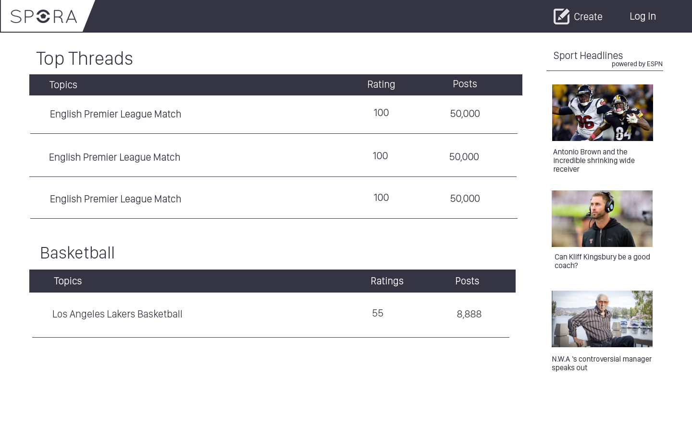
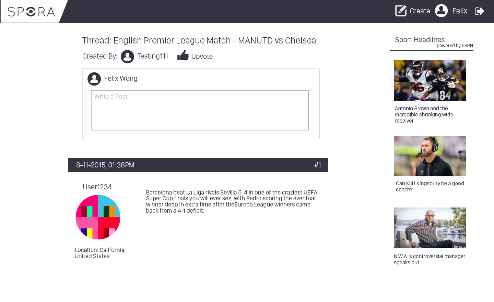
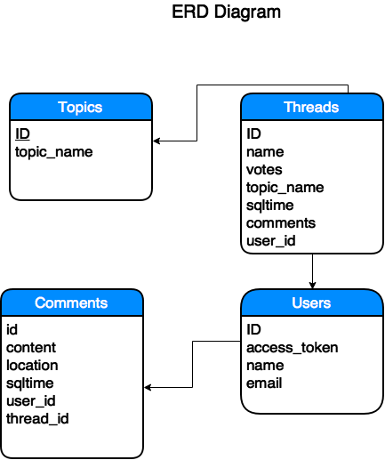

# SPORA - Sports Forum
Spora is a sports forum that allows users to create threads to discuss about different sports(basektball, soccer, baseball).Users can post comments on certain threads as well as vote on.
## User Specifications/Stories
1.User goes to Home Page
2.User sees list of threads categorized by topics
3.User can login and create a new thread by adding a thread title and a comments
4.User can also view existing threads and comment on the existing thread
## Wireframes/Mockups

## Routes
Routes:

<li>app.get("/")</li>
<li>app.get("/topics/:id/threads")</li>
<li>app.get("/topics/:id/threads/:id2")</li>
<li>app.get("/topics/:id/threads/")</li>
<li>app.get("/topics/:id/threads/new")</li>
<li>app.post("/topics/:id/threads")</li>
<li>app.put('/topics/:id/threads/:idd'</li>
<li>app.get('/topics/:id/new'</li>

##Pseudocode

## Database Design

## Credits
TODO: Write credits
## License
TODO: Write license
