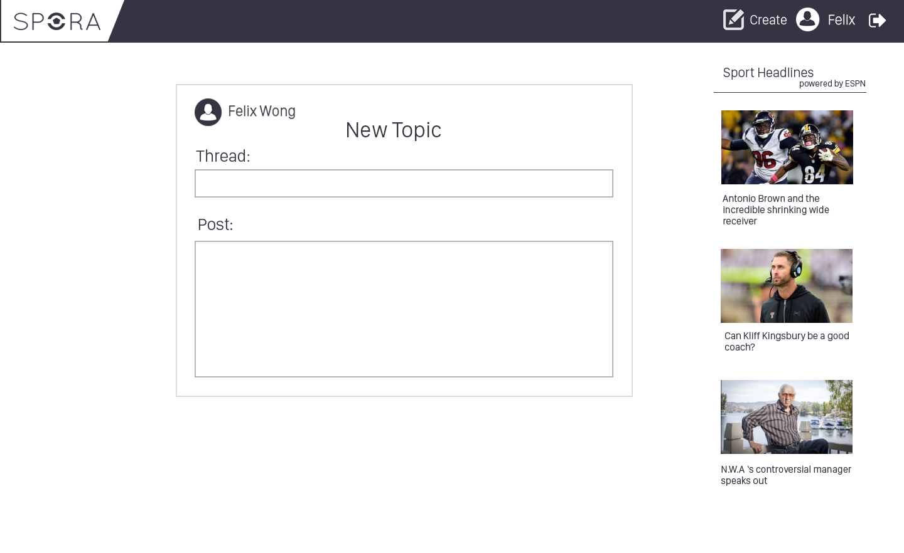

# SPORA - Sports Forum
Spora is a sports forum that allows users to create threads to discuss about different sports(basektball, soccer, baseball).Users can post comments on certain threads as well as vote on.
## User Specifications/Stories
<li>1.User goes to Home Page</li>
<li>2.User sees list of threads categorized by topics</li>
<li>3.User can login and create a new thread by adding a thread title and a comments</li>
<li>4.User can also view existing threads and comment on the existing thread</li>
## Wireframes/Mockups

## Routes
Routes:

<li>app.get("/")</li>
<li>app.get("/topics/:id/threads")</li>
<li>app.get("/topics/:id/threads/:id2")</li>
<li>app.get("/topics/:id/threads/")</li>
<li>app.get("/topics/:id/threads/new")</li>
<li>app.post("/topics/:id/threads")</li>
<li>app.put('/topics/:id/threads/:idd'</li>
<li>app.get('/topics/:id/new'</li>

##Pseudocode
<h3>Backend pseudocode:</h3>

//read all teams 
1. get the routes 
2. read template (index.html) 
3. get data from threads table 
4. render data to ejs template. 

//read specific topic 
1. get the route /app/topics/:id 
2. get data from threads and topics table (JOIN) 
3. append user data (from facebook session) to data retrieved from database 
4. render data through ejs 

//display top feed 
1.get the route '/app/top' 
2. read show_threads.html 
3. get data from threads table and rank them by votes 
4. render data through ejs 

//display specific thread 
1. get the route /app/topics/:id/threads/:idd 
2.read show_topic.html 
3. get threads data from database 
4. get data from comments and threads table in which the threads id is equal to the comments id 
5.render data through ejs 

//POST comments 
1. post on the route /app/topics/:id/threads 
2. get geolocation by making api call to http://ipinfo.io/json 
3. insert into comments table 
4. update number of votes accordingly 
5. redirect user to home page 

//edit votes 
1. send put request to '/app/topics/:id/threads/:idd' 
2. update the data in the threads table (add one to vote each time thumbs icon is clicked) 
3. redirect user to threads page 

//CREATE NEW THREAD 
1. get the route '/app/topics/:id/new' 
2. read create.html file 
3. display form to user through ejs 

//CREATE NEW THREAD 
1. send post request to /app/topics 
2. insert into threads table with the form data retrieved from user 
3. insert into comments table with the comments the user wrote 
4. redirect user back to topics page 

## Database Design

## Credits
Libraries:

Node.js, express.js, passport.js

Repository used: 

https://github.com/jaredhanson/passport-facebook

